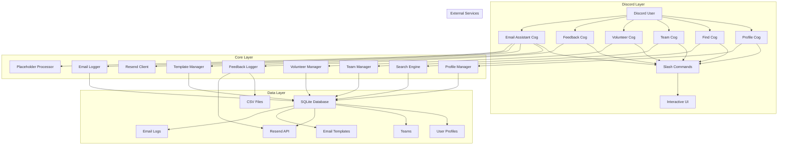
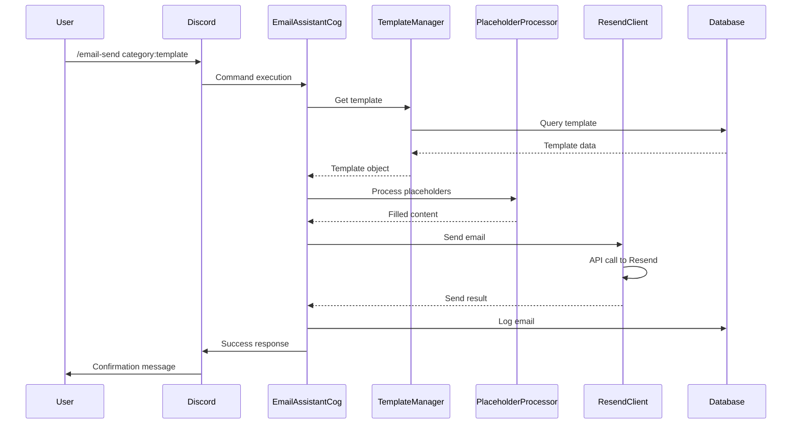
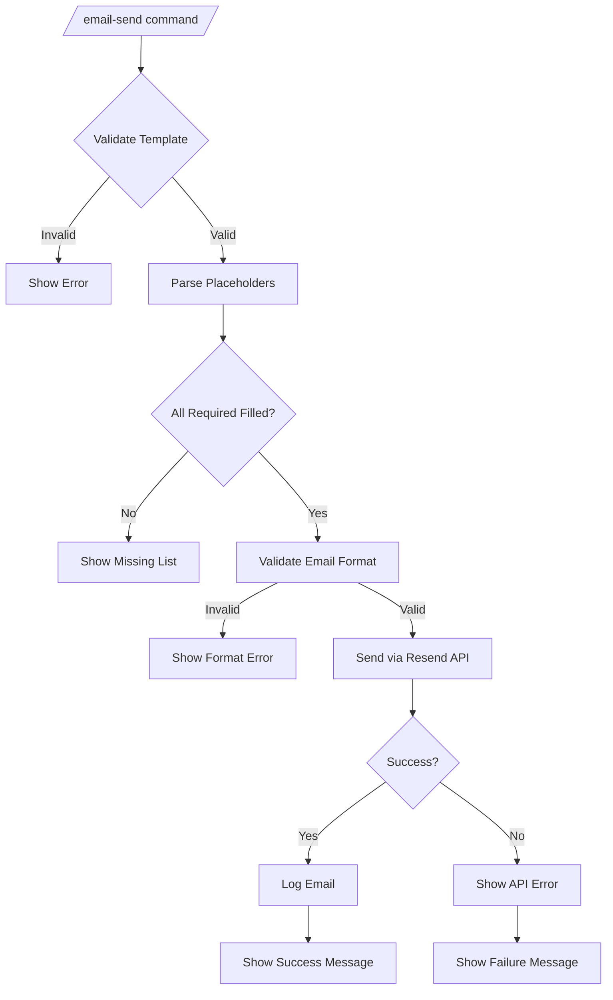
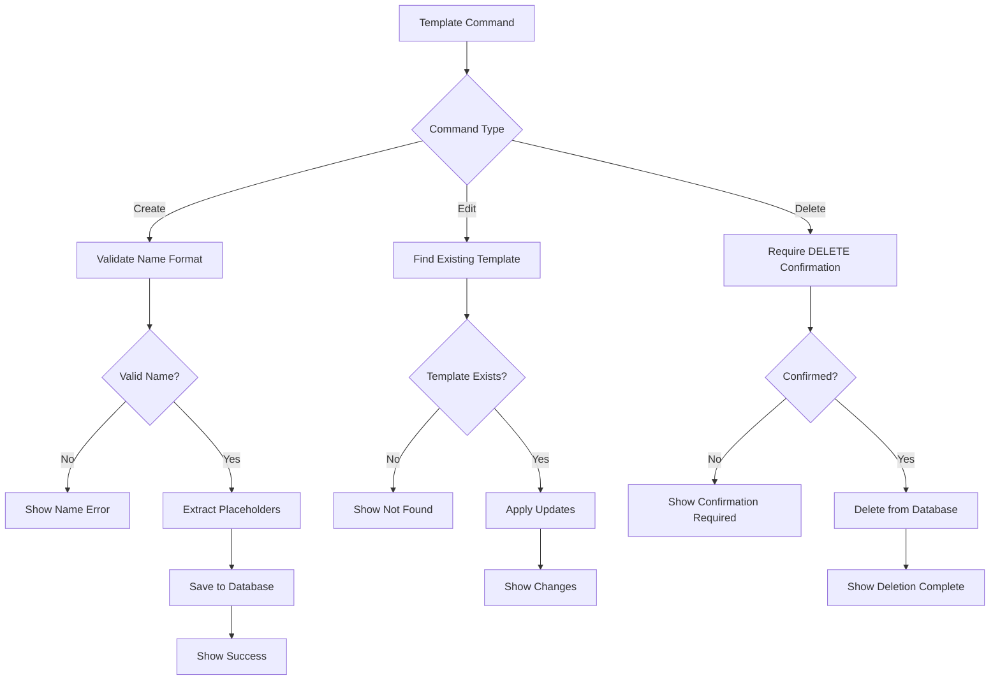
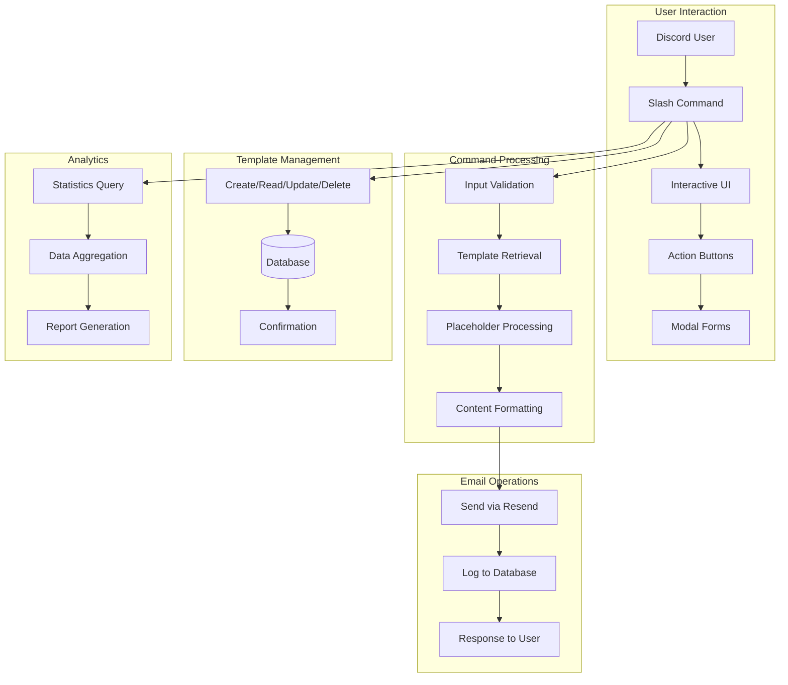

# 🤖 Maxy - Comprehensive Discord Bot

Maxy is a comprehensive Discord bot designed for hackathon operations and community management. Featuring advanced email automation, user profiling, team formation, user discovery, volunteer coordination, and feedback collection capabilities. Built with professional email template management, dynamic placeholder processing, and seamless integration with the Resend API.

## 🎯 Features

### 📧 Email Automation System
- **53 Professional Email Templates** across 10 categories
- **Dynamic Placeholder System** with advanced formatting
- **Interactive Discord Interface** with buttons and modals
- **Template Management** - Create, edit, delete templates
- **Email Analytics** - Track sending statistics and history
- **Privacy Protection** - Secure email logging with hashing
- **Error Handling** - Comprehensive validation and user feedback
- **Bulk Operations** - Efficient template processing

### 👤 User Profile Management
- **Profile Creation** - Register with skills and interests
- **Profile Editing** - Update personal information
- **Profile Viewing** - Display formatted profile information

### 🔍 User Discovery
- **Skill-Based Search** - Find users by technical skills
- **Interest-Based Search** - Discover users with similar interests
- **Advanced Filtering** - Combine multiple search criteria

### 👥 Team Formation
- **Team Creation** - Start new teams with unique codes
- **Team Joining** - Join existing teams via invitation codes
- **Team Management** - View, leave, and manage team membership
- **Ownership Transfer** - Transfer team leadership
- **Team Deletion** - Remove teams with confirmation

### 💬 Feedback System
- **Anonymous Feedback** - Send suggestions to developers
- **CSV Logging** - Store feedback for analysis
- **Timestamp Tracking** - Record submission times

### 🤝 Volunteer Management
- **Task Creation** - Create volunteer opportunities for hackathons
- **Task Participation** - Join and leave volunteer tasks
- **Task Tracking** - Monitor volunteer status and participation
- **Task Management** - Administrative controls for task management
- **Participant Management** - Track volunteer participants and their commitments

## 📋 Table of Contents

- [Quick Start](#-quick-start)
- [Architecture](#-architecture)
- [Folder Structure](#-folder-structure)
- [Installation](#-installation)
- [Configuration](#-configuration)
- [Command Reference](#-command-reference)
  - [Profile Commands](#profile-commands)
  - [User Discovery Commands](#user-discovery-commands)
  - [Team Commands](#team-commands)
  - [Volunteer Commands](#volunteer-commands)
  - [Feedback Commands](#feedback-commands)
  - [Email Commands](#email-commands)
- [Usage Examples](#-usage-examples)
- [Technical Details](#-technical-details)
- [Flowcharts](#-flowcharts)
- [Contributing](#-contributing)
- [License](#-license)

---

## 🚀 Quick Start

```bash
# 1. Install dependencies
pip install -r requirements.txt

# 2. Configure environment
cp .env.example .env
# Edit .env with your Discord token and Resend API key

# 3. Run Maxy
python main.py

# 4. Use in Discord
/register-profile name:"Your Name" skills:"Python, JavaScript" interests:"AI, Web Dev"
/email action:help
```

---

## 🏗️ Architecture

### System Overview



### Component Architecture

Maxy follows a modular architecture with clear separation of concerns across multiple specialized cogs:

1. **Presentation Layer** - Discord slash commands and interactive UI components
2. **Business Logic Layer** - Profile management, team operations, user discovery, volunteer coordination, feedback collection, and email processing
3. **Data Access Layer** - SQLite database operations for profiles, teams, volunteer tasks, and email data
4. **External Integration Layer** - Resend API communication for email sending
5. **Utility Layer** - Shared validation, embedding, and formatting utilities

#### Cog Architecture
- **ProfileCog** - User profile creation, editing, and viewing
- **FindCog** - User discovery based on skills and interests
- **TeamCog** - Team formation, management, and membership operations
- **VolunteerCog** - Volunteer task creation, management, and participant coordination
- **FeedbackCog** - Anonymous feedback collection and logging
- **EmailAssistantCog** - Comprehensive email template management and sending

### Data Flow



---

## 📁 Folder Structure

```
maximally-bot/
├── bot/                          # Main bot package
│   ├── cogs/                     # Discord bot extensions
│   │   ├── __init__.py          # Cog package initialization
│   │   ├── email_assistant.py   # EMAIL ASSISTANT COG
│   │   │   ├── EmailAssistantCog class
│   │   │   ├── Interactive UI components
│   │   │   ├── Command handlers
│   │   │   └── Error handling
│   │   ├── profile.py           # PROFILE MANAGEMENT COG
│   │   │   ├── ProfileCog class
│   │   │   ├── User registration
│   │   │   ├── Profile editing
│   │   │   └── Profile viewing
│   │   ├── find.py              # USER DISCOVERY COG
│   │   │   ├── FindCog class
│   │   │   ├── Skill-based search
│   │   │   ├── Interest filtering
│   │   │   └── Result pagination
│   │   ├── team.py              # TEAM MANAGEMENT COG
│   │   │   ├── TeamCog class
│   │   │   ├── Team creation/joining
│   │   │   ├── Membership management
│   │   │   └── Ownership transfer
│   │   └── feedback.py          # FEEDBACK COLLECTION COG
│   │       ├── FeedbackCog class
│   │       ├── Anonymous feedback
│   │       ├── CSV logging
│   │       └── Timestamp tracking
│   │   └── volunteer.py         # VOLUNTEER MANAGEMENT COG
│   │       ├── VolunteerCog class
│   │       ├── Task creation/management
│   │       ├── Participant tracking
│   │       ├── Status monitoring
│   │       └── Administrative controls
│   ├── core/                     # Core bot functionality
│   │   ├── __init__.py          # Core package init
│   │   ├── bot.py               # Main bot class
│   │   ├── database.py          # General database operations
│   │   └── logger.py            # Logging configuration
│   ├── email/                   # EMAIL SYSTEM COMPONENTS
│   │   ├── __init__.py          # Email package init
│   │   ├── all_templates.py     # 53 EMAIL TEMPLATES
│   │   │   ├── Template definitions
│   │   │   ├── Category organization
│   │   │   └── Placeholder examples
│   │   ├── database.py          # EMAIL DATABASE OPERATIONS
│   │   │   ├── Template CRUD
│   │   │   ├── Email logging
│   │   │   ├── Statistics queries
│   │   │   └── Connection management
│   │   ├── email_logger.py      # EMAIL LOGGING SYSTEM
│   │   │   ├── Email audit trail
│   │   │   ├── Privacy protection
│   │   │   ├── Usage statistics
│   │   │   └── Log management
│   │   ├── models.py            # DATA MODELS
│   │   │   ├── Template class
│   │   │   ├── EmailLog class
│   │   │   ├── TemplateCategory enum
│   │   │   └── TemplateTone enum
│   │   ├── placeholder_processor.py # PLACEHOLDER SYSTEM
│   │   │   ├── Dynamic content replacement
│   │   │   ├── Formatting options
│   │   │   ├── Validation system
│   │   │   └── Preview generation
│   │   └── resend_client.py     # EMAIL SENDING CLIENT
│   │       ├── Resend API integration
│   │       ├── Email validation
│   │       ├── Error handling
│   │       └── Rate limiting
│   └── utils/                   # Shared utilities
│       ├── __init__.py          # Utils package init
│       ├── embed.py             # Discord embed helpers
│       └── validation.py        # Input validation
├── config.py                    # CONFIGURATION MANAGEMENT
│   ├── Environment variables
│   ├── API keys
│   ├── Database paths
│   └── Bot settings
├── data/                        # DATABASE FILES
│   ├── profiles.db             # User profiles & teams
│   └── email_assistant.db      # Email templates & logs
├── feedback.csv                # FEEDBACK LOGS
├── tests/                       # TEST SUITE
│   ├── __init__.py             # Test package init
│   ├── test_email_workflow.py  # COMPREHENSIVE TESTS
│   └── test_simple_email.py    # BASIC FUNCTIONALITY TESTS
├── main.py                      # BOT ENTRY POINT
├── requirements.txt             # PYTHON DEPENDENCIES
├── .env                         # ENVIRONMENT VARIABLES
├── .gitignore                   # GIT IGNORE RULES
└── README.md                    # THIS FILE
```

### File Responsibilities

#### **Core Bot Files**
- **`main.py`**: Application entry point, initializes and runs the Discord bot
- **`config.py`**: Central configuration management for API keys, database paths, and settings
- **`requirements.txt`**: Python dependencies with versions

#### **Bot Core (`bot/core/`)**
- **`bot.py`**: Main Discord bot class with cog loading and event handling
- **`database.py`**: General database operations for user profiles and teams
- **`logger.py`**: Logging configuration and setup

#### **Email System (`bot/email/`)**
- **`models.py`**: Data models for templates, logs, and enums
- **`template_manager.py`**: Template CRUD operations and management
- **`placeholder_processor.py`**: Dynamic content replacement system
- **`resend_client.py`**: Email sending via Resend API
- **`email_logger.py`**: Email audit trail and statistics
- **`database.py`**: Email-specific database operations
- **`all_templates.py`**: Complete collection of 53 email templates

#### **Discord Integration (`bot/cogs/`)**
- **`email_assistant.py`**: Comprehensive email assistant with template management and sending
- **`profile.py`**: User profile creation, editing, and viewing functionality
- **`find.py`**: User discovery system for finding members by skills and interests
- **`team.py`**: Team formation and management with membership controls
- **`feedback.py`**: Anonymous feedback collection and logging system
- **`volunteer.py`**: Volunteer task management and participant coordination

#### **Tests (`tests/`)**
- **`test_email_workflow.py`**: Comprehensive test suite covering all functionality
- **`test_simple_email.py`**: Basic functionality verification

---

## 📦 Installation

### Prerequisites

- Python 3.8+
- Discord Bot Token
- Resend API Key
- SQLite (built-in with Python)

### Step-by-Step Installation

```bash
# 1. Clone the repository
git clone <repository-url>
cd maximally-bot

# 2. Create virtual environment
python -m venv venv
source venv/bin/activate  # On Windows: venv\Scripts\activate

# 3. Install dependencies
pip install -r requirements.txt

# 4. Set up environment variables
cp .env.example .env
```

Edit `.env` file:
```env
DISCORD_TOKEN=your_bot_token_here
GUILD_ID=your_discord_server_id
RESEND_API_KEY=your_resend_api_key
EMAIL_FROM_ADDRESS=contact@yourdomain.com
LOG_LEVEL=INFO
```

```bash
# 5. Initialize database
python -c "from bot.email.database import email_db; print('Database ready')"

# 6. Run the bot
python main.py
```

### Dependencies Explained

```txt
discord.py[voice]==2.3.2      # Discord API wrapper
python-dotenv==1.0.0          # Environment variable management
alembic==1.11.1              # Database migrations (future use)
resend==0.7.0                # Email sending API client
```

---

## ⚙️ Configuration

### Environment Variables

| Variable | Required | Description | Example |
|----------|----------|-------------|---------|
| `DISCORD_TOKEN` | ✅ | Discord bot token | `MTEwNDUz...` |
| `GUILD_ID` | ✅ | Discord server ID | `123456789012345678` |
| `RESEND_API_KEY` | ✅ | Resend API key | `re_1234567890abcdef` |
| `EMAIL_FROM_ADDRESS` | ❌ | Default sender email | `contact@maximally.in` |
| `LOG_LEVEL` | ❌ | Logging verbosity | `INFO` |

### Database Configuration

The system uses two SQLite databases:

1. **`data/profiles.db`** - User profiles, teams, team membership, and volunteer tasks data
2. **`data/email_assistant.db`** - Email templates and sending logs

Database paths can be customized in `config.py`.

---

## 📖 Command Reference

Maxy provides comprehensive commands across multiple categories for complete hackathon management.

---

## Profile Commands

### `/register-profile`

**Purpose**: Create your user profile with skills and interests

**Parameters**:
- `name` (required): Your full name
- `skills` (required): Your skills (comma separated)
- `interests` (required): Your interests (comma separated)

**Usage**:
```bash
/register-profile name:"John Doe" skills:"Python, JavaScript, React" interests:"AI, Web Development, Open Source"
```

**Process**:
1. Validates input format
2. Creates profile in database
3. Shows formatted profile embed

### `/edit-profile`

**Purpose**: Update your existing profile information

**Parameters**:
- `name` (optional): Updated full name
- `skills` (optional): Updated skills (comma separated)
- `interests` (optional): Updated interests (comma separated)

**Usage**:
```bash
/edit-profile name:"John Smith" skills:"Python, JavaScript, React, Node.js"
```

**Process**:
1. Loads current profile
2. Updates provided fields
3. Shows updated profile embed

### `/view-profile`

**Purpose**: View your current profile information

**Parameters**: None

**Usage**:
```bash
/view-profile
```

**Shows**:
- Formatted profile with name, skills, and interests
- Discord username association

---

## User Discovery Commands

### `/find`

**Purpose**: Discover users based on skills and interests

**Parameters**:
- `skills` (optional): Skills to search for
- `interests` (optional): Interests to search for
- `limit` (optional): Number of results (1-20, default: 10)

**Usage**:
```bash
/find skills:"Python, React" interests:"AI"
/find skills:"JavaScript"
/find interests:"Web Development" limit:5
```

**Shows**:
- Matching user profiles
- Skills and interests match indicators
- Paginated results

---

## Team Commands

### `/create-team`

**Purpose**: Create a new team for hackathon participation

**Parameters**:
- `name` (required): Team name

**Usage**:
```bash
/create-team name:"Team Rocket"
```

**Process**:
1. Validates user has profile
2. Checks user isn't already in a team
3. Creates team with unique code
4. Sets user as team owner

**Returns**: Team information with invitation code

### `/join-team`

**Purpose**: Join an existing team using invitation code

**Parameters**:
- `code` (required): Team invitation code

**Usage**:
```bash
/join-team code:"ABC123"
```

**Process**:
1. Validates user has profile
2. Checks user isn't already in a team
3. Validates invitation code
4. Adds user to team

### `/view-team`

**Purpose**: View your current team's information

**Parameters**: None

**Usage**:
```bash
/view-team
```

**Shows**:
- Team name and code
- Team owner
- All team members
- Member count

### `/leave-team`

**Purpose**: Leave your current team

**Parameters**: None

**Usage**:
```bash
/leave-team
```

**Process**:
1. Confirms user is in a team
2. Prevents team owner from leaving
3. Removes user from team
4. Deletes team if empty

### `/delete-team`

**Purpose**: Delete your team (owners only)

**Parameters**: None

**Usage**:
```bash
/delete-team
```

**Process**:
1. Confirms user is team owner
2. Shows confirmation dialog
3. Permanently deletes team
4. Removes all members

### `/transfer-team-ownership`

**Purpose**: Transfer team ownership to another member

**Parameters**:
- `new_owner` (required): Team member to transfer ownership to

**Usage**:
```bash
/transfer-team-ownership new_owner:@username
```

**Process**:
1. Confirms user is current owner
2. Validates new owner is team member
3. Shows confirmation dialog
4. Transfers ownership

---

## Volunteer Commands

### `/volunteer add`

**Purpose**: Create a new volunteer task for hackathon events

**Parameters**:
- `title` (required): Title/description of the volunteer task

**Usage**:
```bash
/volunteer add title:"Help with registration desk at TechCrunch Hackathon"
```

**Process**:
1. Creates a new volunteer task
2. Assigns creator as the task owner
3. Sets status to "open"
4. Returns task details with ID

### `/volunteer list`

**Purpose**: View all available volunteer tasks

**Parameters**: None

**Usage**:
```bash
/volunteer list
```

**Shows**:
- All volunteer tasks with their status
- Task IDs, titles, and creators
- Creation dates and participant counts

### `/volunteer join`

**Purpose**: Join an existing volunteer task

**Parameters**:
- `task_id` (required): ID of the task to join

**Usage**:
```bash
/volunteer join task_id:5
```

**Process**:
1. Validates task exists and is open
2. Adds user as a participant
3. Returns updated task information

### `/volunteer leave`

**Purpose**: Leave a volunteer task you've joined

**Parameters**:
- `task_id` (required): ID of the task to leave

**Usage**:
```bash
/volunteer leave task_id:5
```

**Process**:
1. Removes user from task participants
2. Returns updated task information

### `/volunteer status`

**Purpose**: View your volunteer activity and status

**Parameters**: None

**Usage**:
```bash
/volunteer status
```

**Shows**:
- Tasks you've created
- Tasks you've joined
- Status of each task
- Activity summary

### `/volunteer remove`

**Purpose**: Remove a volunteer task (admin only)

**Parameters**:
- `task_id` (required): ID of the task to remove

**Usage**:
```bash
/volunteer remove task_id:5
```

**Process**:
1. Requires administrator permissions
2. Permanently deletes the task
3. Removes all participants

---

## Feedback Commands

### `/feedback`

**Purpose**: Send anonymous feedback to bot developers

**Parameters**:
- `message` (required): Your feedback or suggestions

**Usage**:
```bash
/feedback message:"Great bot! Could you add feature X?"
```

**Process**:
1. Records feedback with timestamp
2. Saves to CSV file
3. Shows confirmation message

---

## Email Commands

### Main Command: `/email`

**Purpose**: Central hub for all email assistant operations

#### Parameters
- `action` (required): Operation to perform
- `category` (optional): Template category filter

#### Available Actions

##### `/email action:browse`
**Purpose**: Browse available email templates

**Usage**:
```bash
/email action:browse category:judges
```

**Functionality**:
- Shows templates in specified category
- Displays template names, tones, and placeholder counts
- Without category: shows all categories with counts

##### `/email action:send`
**Purpose**: Start email sending workflow

**Usage**:
```bash
/email action:send
```

**Functionality**:
- Shows category selection guide
- Directs user to use `/email-send` command

##### `/email action:stats`
**Purpose**: View email sending statistics

**Usage**:
```bash
/email action:stats
```

**Shows**:
- Total emails sent
- Success rate percentage
- Recent activity (7 days)
- Most popular templates

##### `/email action:history`
**Purpose**: View sent email history

**Usage**:
```bash
/email action:history
```

**Shows**:
- Last 10 emails sent by user
- Template names and dates
- Recipient names (emails hashed)

##### `/email action:manage`
**Purpose**: Show template management options

**Usage**:
```bash
/email action:manage
```

**Shows**: Guide to all template management commands

##### `/email action:help`
**Purpose**: Comprehensive help guide

**Usage**:
```bash
/email action:help
```

**Shows**: All commands, usage examples, placeholder format

---

### Direct Email Commands

#### `/email-send`

**Purpose**: Send email directly using a template

**Parameters**:
- `category` (required): Template category
- `template` (required): Template name
- `recipient_email` (required): Recipient email address
- `recipient_name` (required): Recipient full name
- `placeholders` (optional): Key:value pairs

**Usage**:
```bash
/email-send category:judges template:initial-invite recipient_email:judge@email.com recipient_name:Dr. Smith placeholders:event_name:My Hackathon,date:2024-02-15
```

**Process**:
1. Validates template exists
2. Processes placeholders
3. Validates email format
4. Sends via Resend API
5. Logs the email
6. Shows success/failure confirmation

#### `/email-copy`

**Purpose**: Generate email draft text for copying

**Parameters**:
- `category` (required): Template category
- `template` (required): Template name
- `placeholders` (optional): Key:value pairs

**Usage**:
```bash
/email-copy category:sponsors template:first-touch placeholders:organization:My Company
```

**Output**:
- Formatted email text in code block
- Subject and body clearly separated
- Ready for copy-paste

#### `/email-list`

**Purpose**: Browse available templates

**Parameters**:
- `category` (optional): Filter by category

**Usage**:
```bash
/email-list category:judges
/email-list  # Shows all categories
```

**Output**:
- Template names and descriptions
- Placeholder counts
- Tone information

#### `/email-preview`

**Purpose**: Preview email with filled placeholders

**Parameters**:
- `category` (required): Template category
- `template` (required): Template name
- `placeholders` (required): Key:value pairs

**Usage**:
```bash
/email-preview category:participants template:confirmation placeholders:name:John,event_name:Hackathon
```

**Shows**:
- Completion percentage
- Missing placeholders list
- Formatted email preview
- Subject and body

---

### Template Management Commands

#### `/email-create-template`

**Purpose**: Create new email templates

**Parameters**:
- `category` (required): Template category
- `name` (required): Template name
- `subject` (required): Email subject
- `body` (required): Email body
- `tone` (required): Template tone

**Usage**:
```bash
/email-create-template category:judges name:custom-invite subject:Custom Judge Invite body:Dear {name}, we'd like to invite you... tone:formal
```

**Process**:
1. Validates template name format
2. Extracts placeholders automatically
3. Saves to database
4. Shows created template details

#### `/email-edit-template`

**Purpose**: Modify existing templates

**Parameters**:
- `category` (required): Template category
- `name` (required): Template name
- `new_subject` (optional): Updated subject
- `new_body` (optional): Updated body
- `new_tone` (optional): Updated tone

**Usage**:
```bash
/email-edit-template category:judges name:initial-invite new_subject:Updated Judge Invitation
```

**Shows**: Change summary with before/after values

#### `/email-delete-template`

**Purpose**: Delete templates permanently

**Parameters**:
- `category` (required): Template category
- `name` (required): Template name
- `confirm` (required): Must be "DELETE"

**Usage**:
```bash
/email-delete-template category:judges name:old-template confirm:DELETE
```

**Safety**: Requires explicit confirmation

---

## 💡 Usage Examples

### Profile Management

```bash
# Create your profile
/register-profile name:"Alex Johnson" skills:"Python, React, Node.js" interests:"AI, Web Development, Open Source"

# Update your skills
/edit-profile skills:"Python, React, Node.js, TypeScript"

# View your profile
/view-profile
```

### User Discovery

```bash
# Find users with specific skills
/find skills:"Python, React"

# Find users with similar interests
/find interests:"AI, Machine Learning"

# Find users with both skills and interests
/find skills:"JavaScript" interests:"Web Development" limit:5
```

### Team Formation

```bash
# Create a new team
/create-team name:"Code Wizards"

# Join a team with invitation code
/join-team code:"ABC123"

# View your team information
/view-team

# Leave your current team
/leave-team

# Transfer team ownership
/transfer-team-ownership new_owner:@teammember
```

### Feedback Collection

```bash
# Send feedback to developers
/feedback message:"Love the new team features! Could you add a team chat function?"
```

### Volunteer Management

```bash
# Create a volunteer task
/volunteer add title:"Registration desk helper for AI Hackathon"

# List all volunteer tasks
/volunteer list

# Join a volunteer task
/volunteer join task_id:3

# Check your volunteer status
/volunteer status

# Leave a volunteer task
/volunteer leave task_id:3

# Remove a task (admin only)
/volunteer remove task_id:3
```

### Email Automation

#### Basic Email Sending

```bash
# Send judge invitation
/email-send category:judges template:initial-invite recipient_email:judge@university.edu recipient_name:Dr. Sarah Johnson placeholders:event_name:TechCrunch Hackathon,date:2024-03-15,location:San Francisco
```

#### Template Preview

```bash
# Preview with placeholders
/email-preview category:sponsors template:first-touch placeholders:organization:Google,contact_email:sponsor@google.com,prize_pool:$50,000
```

#### Template Management

```bash
# Create custom template
/email-create-template category:participants name:custom-welcome subject:Welcome to {event_name}! body:Hi {name}, welcome to our amazing hackathon... tone:casual

# Edit existing template
/email-edit-template category:judges name:initial-invite new_subject:You're Invited to Judge {event_name}
```

#### Analytics and History

```bash
# View statistics
/email action:stats

# Check recent emails
/email action:history
```

#### Advanced Placeholder Usage

```bash
# Multiple placeholders with formatting
/email-copy category:press-media template:press-release placeholders:event_name:AI Innovation Summit:upper,organization:TechCorp:title,date:2024-04-15,location:Silicon Valley,contact_email:press@techcorp.com
```

### Complete Workflow Example

```bash
# 1. Set up your profile
/register-profile name:"Sarah Chen" skills:"Python, Data Science" interests:"AI, Hackathons"

# 2. Find teammates
/find skills:"React, Node.js"

# 3. Create or join a team
/create-team name:"DataViz Team"

# 4. Create volunteer opportunities
/volunteer add title:"Registration desk helper for AI Hackathon"

# 5. Find volunteers for your tasks
/volunteer list

# 6. Send professional emails
/email-send category:sponsors template:first-touch recipient_email:sponsor@company.com recipient_name:Ms. Johnson placeholders:organization:TechCorp,event_name:AI Hackathon

# 7. Check email statistics
/email action:stats

# 8. View your volunteer status
/volunteer status

# 9. Provide feedback
/feedback message:"Great bot! The volunteer system is very helpful for organizing events."
```

---

## 🔧 Technical Details

### Template System

#### Template Structure
```python
Template = {
    'id': 'judges_initial-invite_abc123',
    'category': 'judges',
    'name': 'initial-invite',
    'subject': 'Judge Invitation: {event_name} - {date}',
    'body': 'Dear {name}, We would be honored to have you...',
    'tone': 'formal',
    'placeholders': ['name', 'event_name', 'date', 'location'],
    'created_at': '2024-01-01T00:00:00Z',
    'updated_at': '2024-01-01T00:00:00Z'
}
```

#### Placeholder Processing

The system supports advanced placeholder formatting:

```python
# Basic placeholders
{name} → John Doe
{event_name} → Tech Conference

# Formatting options
{name:title} → John Doe
{event_name:upper} → TECH CONFERENCE
{date:yyyy-mm-dd} → 2024-02-15
{prize_pool:currency} → $50,000
```

### Database Schema

#### Email Templates Table
```sql
CREATE TABLE email_templates (
    id TEXT PRIMARY KEY,
    category TEXT NOT NULL,
    name TEXT NOT NULL,
    subject TEXT NOT NULL,
    body TEXT NOT NULL,
    tone TEXT DEFAULT 'formal',
    placeholders TEXT, -- JSON array
    created_at TIMESTAMP DEFAULT CURRENT_TIMESTAMP,
    updated_at TIMESTAMP DEFAULT CURRENT_TIMESTAMP
);
```

#### Email Logs Table
```sql
CREATE TABLE email_logs (
    id TEXT PRIMARY KEY,
    template_id TEXT,
    template_name TEXT NOT NULL,
    recipient_email_hash TEXT NOT NULL, -- Privacy protection
    recipient_name TEXT NOT NULL,
    status TEXT NOT NULL, -- sent, failed
    error_message TEXT,
    sent_at TIMESTAMP DEFAULT CURRENT_TIMESTAMP,
    sent_by INTEGER -- Discord user ID
);
```

#### Volunteer Tasks Table
```sql
CREATE TABLE volunteer_tasks (
    id SERIAL PRIMARY KEY,
    title TEXT NOT NULL,
    creator_id TEXT NOT NULL,
    creator_username TEXT NOT NULL,
    status TEXT DEFAULT 'open',
    created_at TIMESTAMP DEFAULT CURRENT_TIMESTAMP,
    updated_at TIMESTAMP DEFAULT CURRENT_TIMESTAMP
);
```

#### Volunteer Participants Table
```sql
CREATE TABLE volunteer_participants (
    task_id INTEGER NOT NULL,
    discord_id TEXT NOT NULL,
    discord_username TEXT NOT NULL,
    joined_at TIMESTAMP DEFAULT CURRENT_TIMESTAMP,
    PRIMARY KEY (task_id, discord_id)
);
```

### Error Handling

#### API Error Handling
- **Resend API timeouts**: Automatic retry with exponential backoff
- **Rate limiting**: Queue management with user notification
- **Invalid API key**: Clear error message with setup instructions
- **Email validation**: Format checking before sending

#### Template Error Handling
- **Missing template**: Suggestions for similar templates
- **Invalid placeholders**: Clear list of required variables
- **Template parsing**: Fallback to original content

#### User Input Validation
- **Email format**: RFC-compliant validation
- **Required fields**: Clear error messages
- **Template names**: Alphanumeric with hyphens/underscores only

### Security Features

1. **Email Privacy**: SHA-256 hashing of recipient emails in logs
2. **Input Sanitization**: All user inputs validated and cleaned
3. **API Key Protection**: Environment variable storage only
4. **Access Control**: Template management restricted to administrators
5. **Audit Trail**: Complete logging of all operations

---

## 📊 Flowcharts

### Email Sending Flow



### Template Management Flow



### Complete System Flow



---

## 🤝 Contributing

### Development Setup

```bash
# 1. Fork and clone
git clone https://github.com/yourusername/maximally-bot.git
cd maximally-bot

# 2. Set up development environment
python -m venv venv
source venv/bin/activate
pip install -r requirements.txt

# 3. Install development dependencies
pip install pytest black flake8 mypy

# 4. Run tests
python -m pytest tests/

# 5. Format code
black bot/
flake8 bot/
```

### Code Style

- **Black**: Code formatting
- **Flake8**: Linting
- **MyPy**: Type checking
- **Google Style Docstrings**: Documentation

### Testing

```bash
# Run all tests
python -m pytest tests/ -v

# Run specific test
python -m pytest tests/test_email_workflow.py::test_template_inventory -v

# Run with coverage
python -m pytest tests/ --cov=bot --cov-report=html
```

### Adding New Templates

1. Add template to `bot/email/all_templates.py`
2. Follow existing format with placeholders
3. Test with preview command
4. Update documentation

### Pull Request Process

1. Create feature branch: `git checkout -b feature/new-template`
2. Make changes and add tests
3. Run full test suite
4. Update documentation
5. Submit pull request with description

---

## 📄 License

This project is licensed under the MIT License - see the [LICENSE](LICENSE) file for details.

---

## 🆘 Support

### Common Issues

**Q: Email sending fails**
A: Check your Resend API key and ensure it's properly configured in `.env`

**Q: Template not found**
A: Use `/email-list` to see available templates, or check category/name spelling

**Q: Placeholders not filling**
A: Use format `key:value,key:value` and ensure all required placeholders are provided

**Q: Volunteer task not showing up**
A: Check that the task was created successfully and try using `/volunteer list` to see all tasks

**Q: Can't join volunteer task**
A: Make sure you have a profile created first with `/register-profile`, and that the task is still open

**Q: Team creation failed**
A: Ensure you have a profile created and are not already in another team

### Getting Help

1. Check `/email action:help` for email command reference
2. Check `/volunteer status` for volunteer activity overview
3. Review this README for detailed usage
4. Check existing GitHub issues
5. Create new issue with detailed description

### Feature Requests

We welcome feature requests! Please:
1. Check existing issues first
2. Use the "Feature Request" template
3. Provide detailed use case and examples
4. Explain how it benefits hackathon operations

---

**Built with ❤️ for the Maxy Discord community**